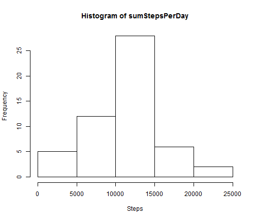
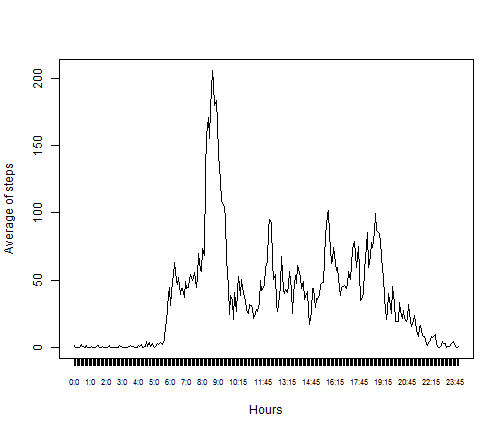
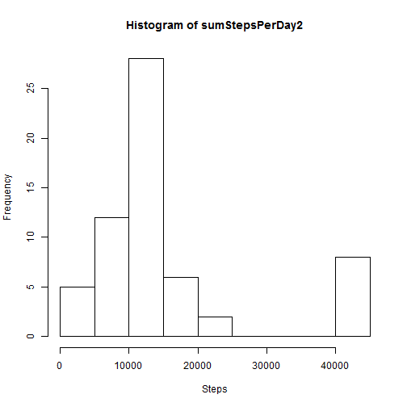
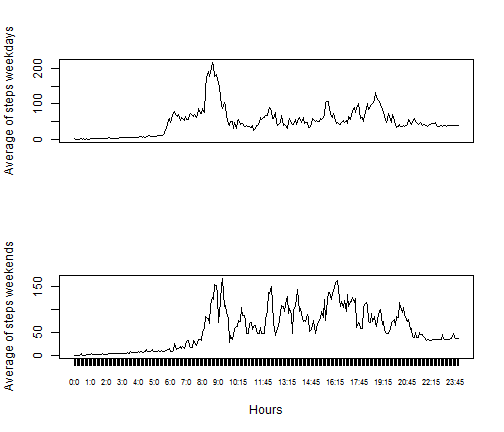

# Reproducible Research: Peer Assessment 1


## Loading and preprocessing the data

```r
data <- read.csv("activity.csv",colClasses=c("numeric","Date","numeric"))
dataWithValues <- data[!is.na(data$steps),]
```


## What is mean total number of steps taken per day?

```r
groupPerDay <- split(dataWithValues,dataWithValues$date)
sumStepsPerDay <- sapply(groupPerDay, function(d) { sum(d[,1])})
hist1 <- hist(sumStepsPerDay,xlab="Steps")
```

 

```r
mean1 <- mean(sumStepsPerDay)
mean1
```

```
## [1] 10766
```

```r
median1 <- median(sumStepsPerDay)
median1
```

```
## [1] 10765
```


## What is the average daily activity pattern?

```r
groupPerInterval <- split(dataWithValues,dataWithValues$interval)
avStepsPerInterval <- sapply(groupPerInterval, function(d) { mean(d[,1])})
intervals <- unique(data$interval)
numIntervals <- seq(intervals)
minutes <- intervals[1:12]
hours <- 0:23
labelIntervals <- paste(rep(hours,each=12),minutes,sep=":")
plot(avStepsPerInterval~numIntervals, type="l",xlab="Hours",ylab="Average of steps",xaxt = 'n')
axis(1,cex.axis=0.7, at=numIntervals, labels=labelIntervals)
```

 

```r
intervalWithMaxActivity <- labelIntervals[match(max(avStepsPerInterval),avStepsPerInterval)]
intervalWithMaxActivity
```

```
## [1] "8:35"
```
## Imputing missing values
To replace the missing data we are going to find the NA values and replace them for the average of the interval.

```r
dataWithNAValues <- data[is.na(data$steps),]
numNA <- nrow(dataWithNAValues)
numNA
```

```
## [1] 2304
```

```r
dataWithMeans <- data
dataWithMeans$interval2 <- 1:288
dataWithMeans[is.na(dataWithMeans$steps),1] <- dataWithMeans[is.na(dataWithMeans$steps),4]
groupPerDay2 <- split(dataWithMeans,dataWithMeans$date)
sumStepsPerDay2 <- sapply(groupPerDay2, function(d) { sum(d[,1])})
hist2 <- hist(sumStepsPerDay2,xlab="Steps")
```

 

```r
mean2 <- mean(sumStepsPerDay2)
mean2
```

```
## [1] 14812
```

```r
median2 <- median(sumStepsPerDay2)
median2
```

```
## [1] 11458
```

## Are there differences in activity patterns between weekdays and weekends?

```r
workingDays <- c("Monday", "Tuesday", "Wednesday", "Thursday", 
  "Friday")
weekend <- c("Saturday", "Sunday")
Sys.setlocale("LC_TIME", "English")
```

```
## [1] "English_United States.1252"
```

```r
dataWithMeans$isWeekend <- weekdays(dataWithMeans$date) %in% weekend
groupPerIntervalWeekdays <- dataWithMeans[!dataWithMeans$isWeekend,]
groupPerIntervalWeekdays <- split(groupPerIntervalWeekdays,groupPerIntervalWeekdays$interval)
avStepsPerIntervalWeekdays <- sapply(groupPerIntervalWeekdays, function(d) { mean(d[,1])})
groupPerIntervalWeekends <- dataWithMeans[dataWithMeans$isWeekend,]
groupPerIntervalWeekends <- split(groupPerIntervalWeekends,groupPerIntervalWeekends$interval)
avStepsPerIntervalWeekends <- sapply(groupPerIntervalWeekends, function(d) { mean(d[,1])})
intervals <- unique(data$interval)
numIntervals <- seq(intervals)
minutes <- intervals[1:12]
hours <- 0:23
labelIntervals <- paste(rep(hours,each=12),minutes,sep=":")


par(mfrow=c(2,1))
plot(avStepsPerIntervalWeekdays~numIntervals, type="l",xlab="",ylab="Average of steps weekdays",xaxt = 'n')+
plot(avStepsPerIntervalWeekends~numIntervals, type="l",xlab="Hours",ylab="Average of steps weekends",xaxt = 'n')
```

```
## numeric(0)
```

```r
axis(1,cex.axis=0.7, at=numIntervals, labels=labelIntervals)
```

 
